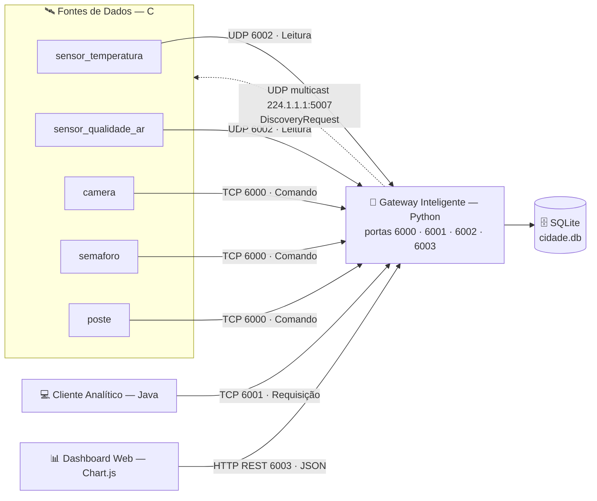
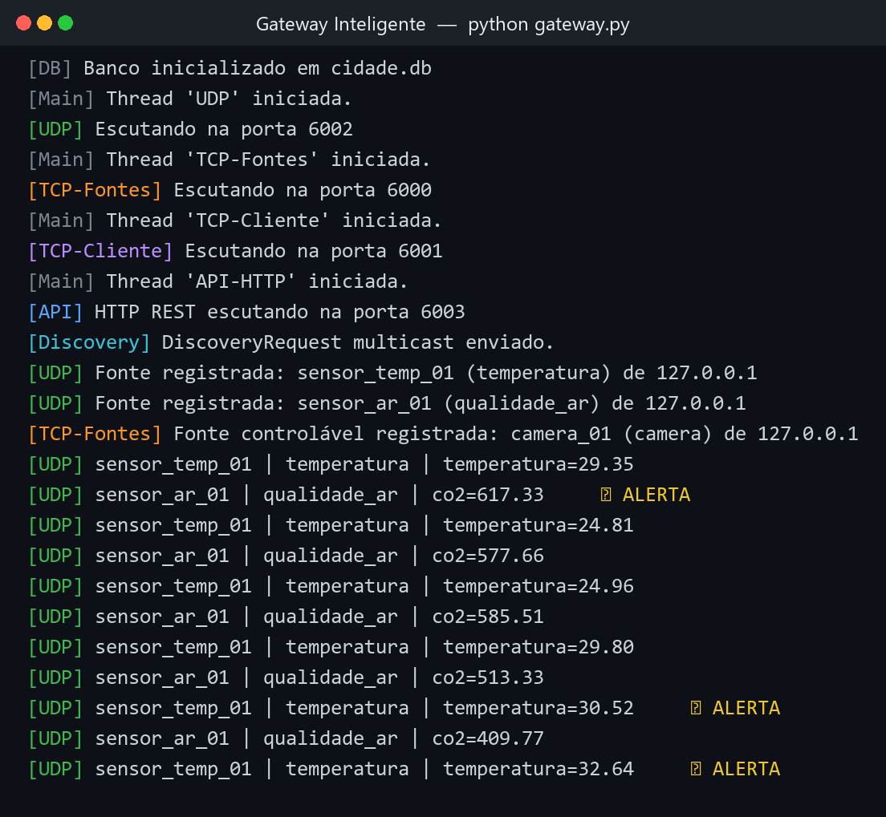
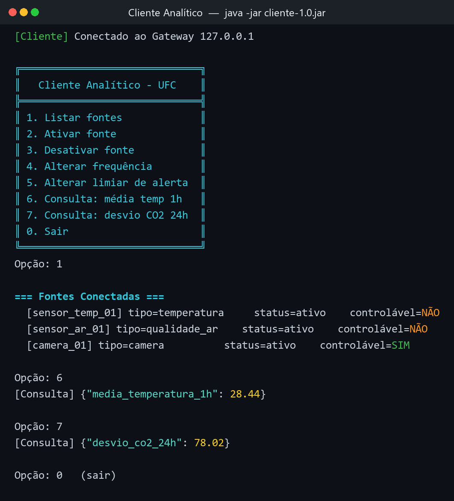
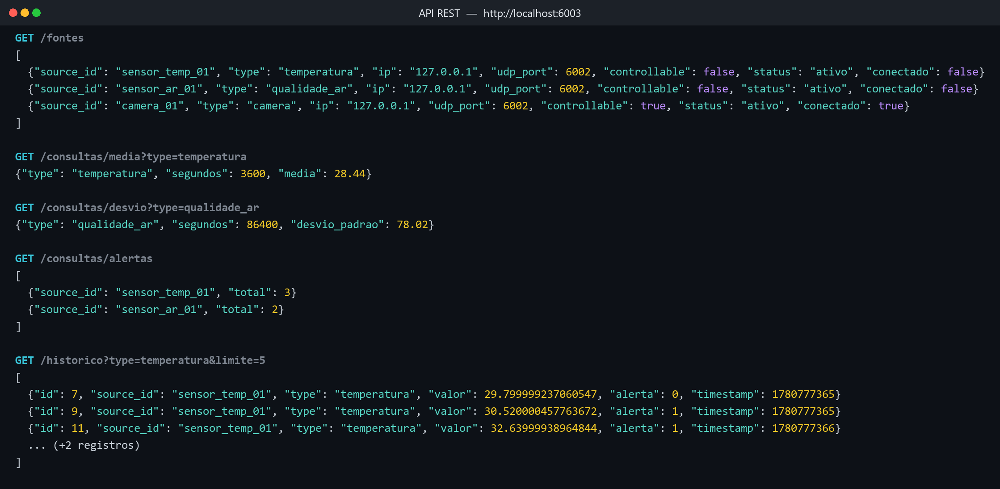
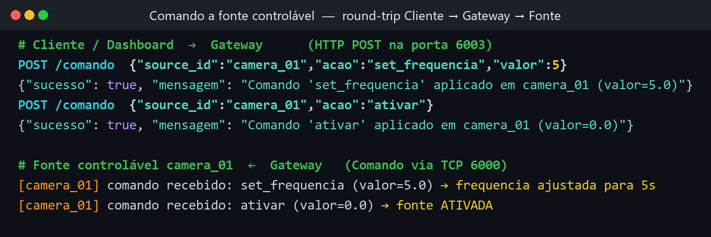

# 🌆 SmartCity

> Sistema distribuído de cidade inteligente: gateway em Python conectando sensores em C a um cliente Java via sockets.


-A8B9CC?logo=c&logoColor=black)


Simulação de uma cidade inteligente composta por **três processos independentes, escritos em três
linguagens diferentes**, que se comunicam por **TCP**, **UDP unicast** e **UDP multicast**, com
**todas as mensagens serializadas em Protocol Buffers**.

> Trabalho 1 — *Distribuição de Processos e Dados* · Universidade Federal do Ceará (UFC)

---

## 🎬 Demonstração em Vídeo

[](https://youtu.be/LINK_DO_VIDEO)

---

## 🧩 Arquitetura



| Componente | Linguagem / Build | Papel |
|---|---|---|
| **Gateway Inteligente** | Python 3 | Hub central: descobre fontes, coleta leituras, persiste, controla atuadores e expõe API REST |
| **Fontes de Dados** | C · GCC + `protobuf-c` | 5 processos: 2 sensores contínuos + 3 atuadores controláveis |
| **Cliente Analítico** | Java 21 · Maven | Menu interativo: lista fontes, envia comandos e faz consultas agregadas |
| **Dashboard Web** | HTML + Chart.js | Gráficos em tempo real consumindo a API REST |

---

## 🚀 Em funcionamento

### 1. Gateway descobrindo fontes e coletando leituras (com alertas)
O Gateway sobe 4 servidores concorrentes, dispara o *discovery* multicast, registra as fontes e
passa a receber `Leitura`s — disparando ⚠️ alertas quando um valor ultrapassa o limiar.



### 2. Cliente Analítico (Java) conversando com o Gateway via TCP
Listagem das fontes conectadas e consultas agregadas (média e desvio padrão) — tudo trafegando em
Protocol Buffers com *framing* de 4 bytes.



### 3. API REST servindo o Dashboard
Mesmos dados disponíveis em JSON para o dashboard web e qualquer cliente HTTP.



### 4. Controle de atuadores — comando com round-trip
Um `POST /comando` (ou o menu do Cliente Java) percorre **Cliente → Gateway → Fonte** por TCP e
retorna a confirmação enviada pela própria fonte controlável.



---

## 🛠️ Tecnologias, frameworks e bibliotecas

| Camada | Tecnologia | Versão | Papel |
|---|---|---|---|
| Serialização | **Protocol Buffers** | 4.34.1 | Todas as mensagens, entre todos os processos |
| Gateway | **Python** | 3.x | `socket`, `threading`, `sqlite3`, `http.server` (sem framework externo) |
| Fontes | **C / GCC** + `protobuf-c` | 1.5 | Processos nativos; `pthread` para sensor + escuta de comandos |
| Cliente | **Java** | 21 | `Socket`, `DataInputStream/OutputStream`, `protobuf-java` |
| Build Java | **Maven** + `shade-plugin` | 3.9 | *Uber-JAR* executável com dependências embutidas |
| Persistência | **SQLite** | embutido | Tabelas `leituras` e `fontes`; consultas de média/desvio |
| Dashboard | **Chart.js** | 4.4 (CDN) | Séries temporais no browser via *polling* REST |

---

## 📡 Protocolo de comunicação

**Framing TCP** — todo envio é prefixado por **4 bytes big-endian** com o tamanho do payload
protobuf (idêntico em Python, C e Java):

```
┌──────────┬──────────┬──────────┬──────────┬───────────────────────────────┐
│  byte 0  │  byte 1  │  byte 2  │  byte 3  │       payload (N bytes)       │
│  N>>24   │  N>>16   │  N>>8    │  N&0xFF  │   mensagem protobuf serializada│
└──────────┴──────────┴──────────┴──────────┴───────────────────────────────┘
```

**Portas e canais:**

| Protocolo | Porta | Direção | Mensagens |
|---|---|---|---|
| UDP Multicast | `224.1.1.1:5007` | Gateway → Fontes | `DiscoveryRequest` |
| UDP Unicast | `6002` | Fontes → Gateway | `DiscoveryResponse` + `Leitura` |
| TCP | `6000` | Fontes ↔ Gateway | `DiscoveryResponse` + `Comando` + `RespostaComando` |
| TCP | `6001` | Cliente ↔ Gateway | `RequisicaoCliente` + `RespostaGateway` |
| HTTP REST | `6003` | Browser ↔ Gateway | JSON (Dashboard) |

As 7 mensagens estão definidas em [`SmartCity/proto/cidade.proto`](SmartCity/proto/cidade.proto) e
compiladas para Python (`cidade_pb2.py`), C (`cidade.pb-c.*`) e Java (`Cidade.java`).

---

## ▶️ Como executar

> Pré-requisitos: **Python 3**, **GCC + `libprotobuf-c-dev`** (Linux/WSL) e **Java 21 + Maven**.

### 1) Gateway (Python)
```bash
cd SmartCity/gateway
pip install -r requirements.txt
python gateway.py
```

### 2) Fontes de dados (C)
```bash
cd SmartCity/fontes
make                                   # compila os 5 binários
./sensor_temperatura  <ip_gateway> 6002    # sensor contínuo (UDP)
./sensor_qualidade_ar <ip_gateway> 6002    # sensor contínuo (UDP)
./camera   <ip_gateway> 6000               # atuador controlável (TCP)
./semaforo <ip_gateway> 6000               # atuador controlável (TCP)
./poste    <ip_gateway> 6000               # atuador controlável (TCP)
```
> Os argumentos `<ip> <porta>` permitem ligar a fonte diretamente ao Gateway, contornando o
> *discovery* multicast (útil quando as fontes rodam em WSL2 e o Gateway no Windows).

**Script de demo (todas as fontes de uma vez — WSL):**
```bash
# Sobe as 5 fontes em background + instruções para simular falha
chmod +x SmartCity/fontes/demo_fontes.sh
SmartCity/fontes/demo_fontes.sh [<ip_gateway>]
```

### 3) Cliente Analítico (Java)
```bash
cd SmartCity/cliente
mvn package
java -jar target/cliente-1.0.jar
```

### 4) Dashboard Web
Com o Gateway no ar, basta abrir [`SmartCity/cliente/dashboard.html`](SmartCity/cliente/dashboard.html)
no navegador (consome a API REST na porta `6003`).

---

## 🔎 Consultas e API REST

| Método | Rota | Descrição |
|---|---|---|
| `GET` | `/fontes` | Lista todas as fontes registradas |
| `GET` | `/historico?type=&segundos=&limite=` | Leituras recentes filtradas |
| `GET` | `/alertas` | Leituras que dispararam alerta |
| `GET` | `/consultas/media?type=` | Média de um tipo num intervalo |
| `GET` | `/consultas/desvio?type=` | Desvio padrão de um tipo num intervalo |
| `GET` | `/consultas/maior_variacao` | Fonte com maior variação |
| `GET` | `/consultas/alertas` | Total de alertas por fonte |
| `POST` | `/comando` | Envia comando a uma fonte controlável |

---

## 📁 Estrutura do projeto

```
SmartCity/
├── proto/        cidade.proto            → definição única das mensagens
├── gateway/      gateway.py, api.py, db.py, cidade_pb2.py
├── fontes/       *.c, Makefile, cidade.pb-c.*   → 5 fontes em C
└── cliente/      src/, pom.xml, dashboard.html  → cliente Java + dashboard
```